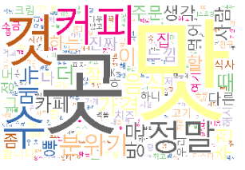
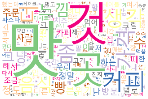

# SCH Text Mining Term Project 

- 본 프로젝트는 sns및 수많은 리뷰 사이트들에 있는 정리되지 않고 버려지는 리뷰 데이터를 보다 요약 및 기계학습으로 감정분류를 진행해 보다 정확한 정보를 빠르게 사용자들이 습득할 수 있도록 아래 3가지 카테고리로 텍스트 마이닝을 진행함.

1. WordCloud

2. Sentiment Classification

3. Text Summary  

#### Members : Nathan, joohyung, dahye

## Sample Results

### Overview 


### Text Summary

Usage Example
```   
text = input you sentences
textrank = TextRank(text)
print(textrank1.summarize(3, verbose=False))  
# up to 3 sentences, returned as list
```
Algorithms Result Example
~~~
input text (source - https://towardsdatascience.com/sentiment-analysis-concept-analysis-and-applications-6c94d6f58c17)
Sentiment analysis is contextual mining of text which identifies and extracts subjective information in source material, and helping a business to understand the social sentiment of their brand, product or service while monitoring online conversations.
However, analysis of social media streams is usually restricted to just basic sentiment analysis and count based metrics.
This is akin to just scratching the surface and missing out on those high value insights that are waiting to be discovered.

summary text
1. 'Sentiment analysis is contextual mining of text which identifies and extracts subjective information in source material,and helping a business to understand the social sentiment of their brand, product or service while monitoring online conversations.', 
2. ' However, analysis of social media streams is usually restricted to just basic sentiment analysis and count based metrics.', 
3. ' This is akin to just scratching the surface and missing out on those high value insights that are waiting to be discovered.']
~~~
- reference: https://github.com/theeluwin/textrankr

### WordCloud
---

#### 긍정문에 대한 WordCloud


#### 부정문에 대한 WordCloud



## Getting Started

### Install dependencies

#### Requirements
 
- pandas
- matplotlib
- konlpy
- mecab
- numpy
- tensorflow == 1.14.0
- imbalanced-learn
- keras-rectified-adam (radm optimzation)
- seaborn
- wordcloud
- gensim(word2vec library)
- xgboost
- networkx

~~~
pip install -r requirements.txt
~~~

#### Tokenize. 
- 리뷰 데이터 전리를 위한 다양한 토큰나이즈와 방식을 비교 분석 진행.
~~~
KoNLPy의 Tokenizer 5개 비교
Hannanum Kkma Mecab Okt Twitter

Accuracy
- Okt(0.7461) Mecab(0.7441) > Twitter(0.7341) > Kkma(0.7309) > Hannanum(0.7282)
F1 – score
- Okt(0.7604) > Mecab(0.7507) > Twitter(0.7457) > Hannanum(0.7412) > Kkma(0.7388)
Recall
- Okt(0.7873) > Hannanum(0.7791) > Mecab(0.7770) > Twitter(0.7753) > Kkma(0.7502)

Okt는 sns인 트위터 분석용으로 만들어진 토크화 방법으로, 리뷰 데이터를 토큰화 하는데 가장 적합한 방법이라고 판단 후 추후 모델링과 데이터 처리는 Okt으로 진행.

~~~


#### PreTrained Model
- 총 9만2천 여개의 리뷰 데이터를 기반으로 trigram 모델을 만듬.
- 해당 모델은 PreTrained 디렉토리에 있음.

### Modeling

#### Method.
1. CounterVecotrizing
    - BOW 기반으로 단어 빈도수가 들어간 단어장을 만든 후 최상위 빈도 수 만개를 가변수로 만들어 학습을 진행. 
2. WordEmbedding
    - 사전에 모은 데이터를 기반으로 Trigram을 만든 후 단어들을 벡터로 변환해 준 후 학습을 진행. 

크게 두 가지의 방식으로 리뷰 데이터에 대한 감정 분류를 진행함.


#### Contact & Feedback
~~~
홍나단 
- E-mail : skeks463@gmail.com
이주형
- E-mail : ljh7061@gmail.com
김다혜  
- E-mail : rhfo1230@naver.com
~~~


#### License
~~~
본 프로젝트에서 사용한 모든 권한은 본 멤버들이 소유하고 있습니다.  
하지만 예외로 문장 요약 알고리즘은 위에 첨부한 Reference 오픈 소스를 이용하였으므로 본 팀의 소유가 아님을 밝힙니다.
    
All rights used in this project are owned team.  
The exception, however, is that the sentence summary algorithm is not owned by the team as it uses the Reference open source attached above.
~~~